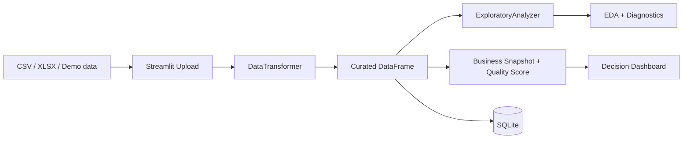

# Data Analytics Workflow

[Versão em Português](README.md)

[](https://github.com/samuelmaia-analytics/data-senior-analytics/actions/workflows/ci.yml)
[](https://www.python.org/downloads/)
[](https://data-analytics-sr.streamlit.app)
[](LICENSE)

Analytics project that turns tabular files into a curated, traceable, decision-ready workflow with a Streamlit dashboard, SQLite persistence, quality indicators, and technical documentation.

Live demo: https://data-analytics-sr.streamlit.app

## Project goal

This project demonstrates practical foundations in data analysis, BI, and analytics engineering: receiving raw data, applying treatment, validating quality, generating indicators, and delivering a clear business-oriented view.

This repository uses a layered approach:
- raw intake via CSV/XLSX or demo datasets;
- automated curation with standardization, dtype inference, null handling, and deduplication;
- versioned scoring and action policy in `config/dashboard_policy.json`;
- business-facing consumption through KPIs, data quality, trends, and priority actions;
- persistence of curated datasets into SQLite;
- good practices with lint, tests, coverage, deploy preflight, and traceability.

## Use case

The dashboard is designed for scenarios where a team needs fast answers:
- is the dataset reliable enough for analysis?
- which indicators need attention?
- are there missing, duplicated, or inconsistent records?
- what should be done before sharing or persisting the dataset?

## Skills demonstrated

- Data treatment and validation with Python/Pandas.
- Analytical dashboard development with Streamlit.
- Code organization into reusable layers.
- Indicators, quality scoring, and business-oriented interpretation.
- Local persistence with SQLite.
- Technical documentation, automated tests, and CI/CD.
- Governance, traceability, and basic privacy-aware data handling.

## What the dashboard delivers

- `Overview`: dataset summary, indicators, quality, risk, and next steps.
- `Upload`: CSV/XLSX ingestion with automated curation and immediate quality scoring.
- `Data`: raw vs curated comparison, with masked previews when personal data is detected.
- `EDA`: statistics, correlation, automated insights, and missing-value profile.
- `Visualizations`: distribution, business mix, and trend analysis.
- `Database`: operational verification of the curated dataset persisted in SQLite.
- `Settings`: runtime, quality, governance, and transformation metadata.

## End-to-end flow

1. The user uploads CSV/XLSX or loads a demo dataset.
2. The app applies `DataTransformer` to build a curated version.
3. `ExploratoryAnalyzer` produces statistics and automated insights.
4. `dashboard/utils/analytics.py` converts profiling into briefing, governance, concentration, and a decision-oriented narrative.
5. The user can persist the curated dataset into SQLite.

## Architecture



Related documentation:
- [docs/ARCHITECTURE.md](docs/ARCHITECTURE.md)
- [docs/STREAMLIT_CLOUD.md](docs/STREAMLIT_CLOUD.md)
- [docs/DATA_CONTRACT.md](docs/DATA_CONTRACT.md)
- [docs/DATA_LINEAGE.md](docs/DATA_LINEAGE.md)
- [docs/DATA_PROVENANCE.md](docs/DATA_PROVENANCE.md)

## Screenshots / Demo


## Stack

- `streamlit` for dashboard and user experience
- `pandas` and `numpy` for transformation and profiling
- `plotly` for analytical visualization
- `sqlite3` via `SQLiteManager` for persistence
- `ruff`, `black`, `pytest`, and `pytest-cov` for code quality

## Local run

```bash
git clone https://github.com/samuelmaia-analytics/data-senior-analytics.git
cd data-senior-analytics
python -m venv .venv

# Linux/macOS
source .venv/bin/activate

# Windows PowerShell
.venv\Scripts\Activate.ps1

pip install -r requirements-dev.txt
python -m streamlit run dashboard/app.py
```

## Quality and operations

- CI with lint, format, tests, and coverage.
- Coverage gate at `>=70%`.
- Streamlit Cloud preflight checks.
- Encoding, provenance, and data manifest validation.
- Basic governance and privacy controls for personal data in previews and persistence.
- Persistence registry and audit trail in SQLite.
- Schedulable retention purge script and governed export with audit.
- Deployment runtime aligned on `Python 3.11`.
- Dashboard smoke tests as part of product-surface validation.

## Repository structure

- `dashboard/`: Streamlit interface and user experience composition
- `src/app/`: application services and curated workflow orchestration
- `src/analysis/`: automated exploratory analysis
- `src/data/`: curation, ingestion, and persistence
- `config/`: paths and runtime metadata
- `docs/`: architecture, deployment, and governance
- `docs/LGPD_GOVERNANCE.md`: practical privacy interpretation applied to the analytics workflow
- `tests/`: automated behavior protection

## For recruiters and leads

This project demonstrates readiness to contribute to data analysis, BI, analytical automation, and business-support initiatives. It is suitable for conversations about Data Analyst, BI Analyst, early/intermediate Analytics Engineer, or freelance data organization and visualization projects.

## License

Licensed under MIT. See [LICENSE](LICENSE).
