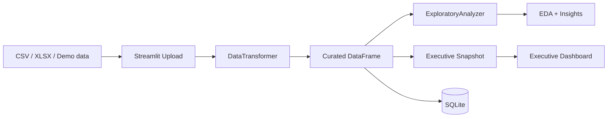

# Data Senior Analytics

[Versao em Portugues](README.md)

[](https://github.com/samuelmaia-analytics/data-senior-analytics/actions/workflows/ci.yml)
[](https://codecov.io/gh/samuelmaia-analytics/data-senior-analytics)
[](LICENSE)
[](https://www.python.org/downloads/)

Business-focused analytics project that turns raw tabular files into a curated, governed, and executive-ready decision workflow.

Live demo: https://data-analytics-sr.streamlit.app

## Executive Summary
- Problem: business teams still rely on slow spreadsheets, weak quality standards, and poor traceability.
- Solution: layered pipeline with upload, automated curation, EDA, executive visualization, SQLite persistence, and deployment governance.
- Outcome: senior-level Streamlit dashboard with quality scoring, profiling, transformation traceability, and production discipline.

## What the product delivers
- Automated dataset curation: column standardization, dtype inference, null handling, and deduplication.
- Executive view: KPI cards, top category, top region, revenue trend, and priority actions.
- Technical diagnostics: descriptive statistics, correlation analysis, column profiling, and transformation summary.
- Analytical persistence: curated datasets can be saved into SQLite for reuse.
- Observability: structured logs with `trace_id` and per-page timing.

## Dashboard Workflow
1. Load a demo dataset or upload CSV/XLSX.
2. Apply automated curation to the raw dataset.
3. Calculate quality score and executive briefing.
4. Expose EDA, charts, and business signals.
5. Persist the curated dataset into SQLite.

## Core Executive Signals
- `Quality Score`: release signal for executive consumption.
- `Completeness`: integrity indicator after curation.
- `Top category` and `Top region`: commercial concentration view.
- `Revenue trend`: temporal revenue behavior when a date field exists.
- `Priority actions`: business translation of technical data quality issues.

## Screenshots / Demo


## Architecture


Related documentation:
- [docs/ARCHITECTURE.md](docs/ARCHITECTURE.md)
- [docs/STREAMLIT_CLOUD.md](docs/STREAMLIT_CLOUD.md)
- [docs/DATA_CONTRACT.md](docs/DATA_CONTRACT.md)
- [docs/DATA_LINEAGE.md](docs/DATA_LINEAGE.md)
- [docs/DATA_PROVENANCE.md](docs/DATA_PROVENANCE.md)

## Stack
- `streamlit` for the presentation layer
- `pandas` and `numpy` for manipulation and profiling
- `plotly` for executive charts
- `sqlite3` via `SQLiteManager` for local persistence
- `ruff`, `black`, and `pytest` for engineering discipline

## Local Run
```bash
git clone https://github.com/samuelmaia-analytics/data-senior-analytics.git
cd data-senior-analytics
python -m venv .venv

# Linux/macOS
source .venv/bin/activate

# Windows PowerShell
.venv\Scripts\Activate.ps1

pip install -r requirements-dev.txt
python -m streamlit run dashboard/app.py
```

## Quality and Engineering
- CI enforces lint, format, tests, coverage, and manifest/provenance checks.
- Coverage gate configured at `>=70%`.
- Streamlit Cloud preflight and deploy smoke tests are part of the operational workflow.
- Output contracts and encoding checks reduce operational regressions.

## Streamlit Cloud
- Expected runtime: `Python 3.11`
- Dependencies: [requirements.txt](requirements.txt)
- Entrypoint: `dashboard/app.py`
- Operational guide: [docs/STREAMLIT_CLOUD.md](docs/STREAMLIT_CLOUD.md)

## Repository Structure
- `dashboard/`: Streamlit app and analytics UI utilities
- `src/analysis/`: exploratory analysis layer
- `src/data/`: ingestion, transformation, and persistence
- `config/`: paths and data metadata
- `docs/`: architecture, governance, and runbooks
- `tests/`: automated test suite

## License
Licensed under MIT. See [LICENSE](LICENSE).
