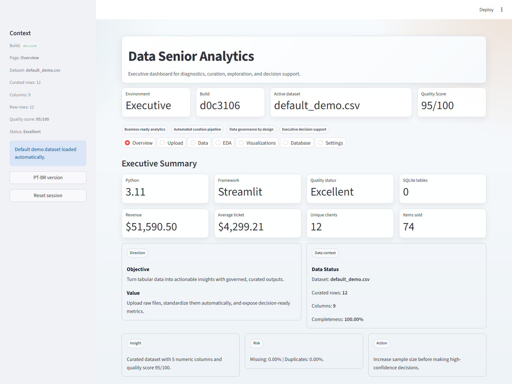
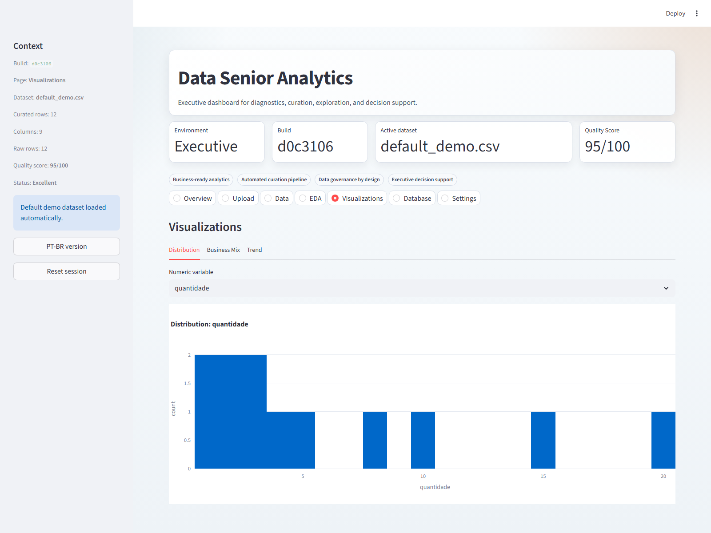
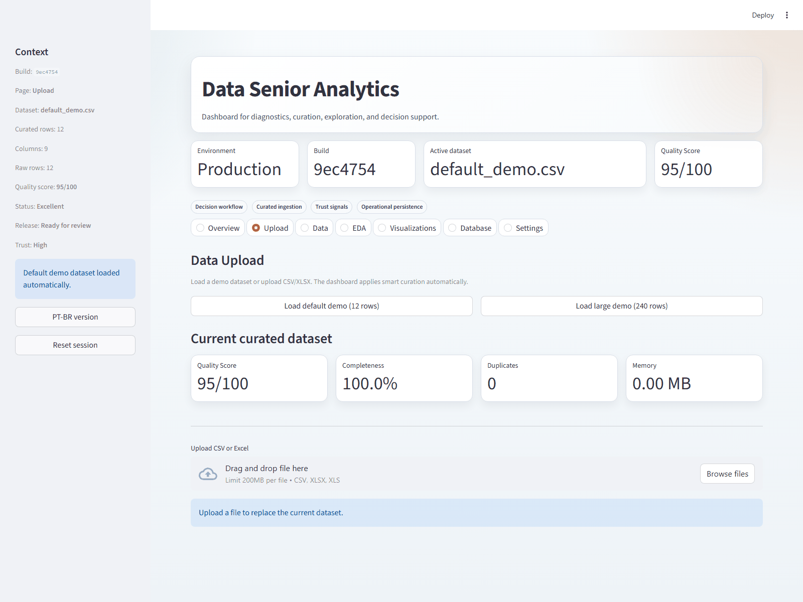
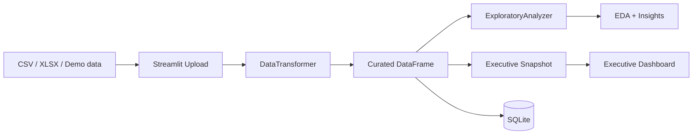

# Data Senior Analytics

[English version](README.en.md)

[](https://github.com/samuelmaia-analytics/data-senior-analytics/actions/workflows/ci.yml)
[](https://codecov.io/gh/samuelmaia-analytics/data-senior-analytics)
[](LICENSE)
[](https://www.python.org/downloads/)

Projeto de analytics orientado ao negocio que transforma arquivos tabulares brutos em um fluxo curado, governado e pronto para decisao executiva.

Demo online: https://data-analytics-sr.streamlit.app

## Resumo Executivo
- Problema: times de negocio ainda dependem de planilhas lentas, sem padrao de qualidade e sem rastreabilidade.
- Solucao: pipeline em camadas com upload, curadoria automatica, EDA, visualizacao, persistencia SQLite e sinalizacao executiva de qualidade.
- Resultado: dashboard Streamlit em padrao senior, com score de qualidade, profiling, trilha de transformacoes e governanca de deploy.

## O que o produto entrega
- Curadoria automatica de dataset: padronizacao de nomes, inferencia de tipos, tratamento de nulos e deduplicacao.
- Leitura executiva: KPI, top categoria, top regiao, tendencia de receita e acoes prioritarias.
- Diagnostico tecnico: estatisticas, correlacao, perfil de colunas e resumo do pipeline aplicado.
- Persistencia analitica: o dataset curado pode ser salvo em SQLite para consulta posterior.
- Observabilidade: logs estruturados com `trace_id` e medicao por pagina.

## Fluxo do Dashboard
1. Carrega um dataset demo ou faz upload de CSV/XLSX.
2. Aplica curadoria automatica no dataset bruto.
3. Calcula score de qualidade e um briefing executivo.
4. Exibe EDA, visualizacoes e sinais de negocio.
5. Persiste a versao curada no SQLite.

## Principais Sinais Executivos
- `Quality Score`: indica prontidao do dataset para uso executivo.
- `Completeness`: mostra integridade da base apos curadoria.
- `Top category` e `Top region`: sinalizam concentracao comercial.
- `Revenue trend`: mostra dinamica temporal quando existe coluna de data.
- `Priority actions`: traduz qualidade tecnica em recomendacoes acionaveis.

## Screenshots / Demo




## Arquitetura


Documentacao relacionada:
- [docs/ARCHITECTURE.md](docs/ARCHITECTURE.md)
- [docs/STREAMLIT_CLOUD.md](docs/STREAMLIT_CLOUD.md)
- [docs/DATA_CONTRACT.md](docs/DATA_CONTRACT.md)
- [docs/DATA_LINEAGE.md](docs/DATA_LINEAGE.md)
- [docs/DATA_PROVENANCE.md](docs/DATA_PROVENANCE.md)

## Stack
- `streamlit` para a camada de apresentacao
- `pandas` e `numpy` para manipulacao e profiling
- `plotly` para visualizacoes executivas
- `sqlite3` via `SQLiteManager` para persistencia local
- `ruff`, `black` e `pytest` para disciplina de engenharia

## Execucao Local
```bash
git clone https://github.com/samuelmaia-analytics/data-senior-analytics.git
cd data-senior-analytics
python -m venv .venv

# Linux/macOS
source .venv/bin/activate

# Windows PowerShell
.venv\Scripts\Activate.ps1

pip install -r requirements-dev.txt
python -m streamlit run dashboard/app.py
```

## Qualidade e Engenharia
- CI com lint, format, testes, coverage e checks de manifest/proveniencia.
- Gate de cobertura configurado em `>=70%`.
- Smoke tests de deploy para Streamlit Cloud.
- Contratos de saida e checks de encoding para evitar regressao operacional.

## Streamlit Cloud
- Runtime esperado: `Python 3.11`
- Dependencias: [requirements.txt](requirements.txt)
- Entrypoint: `dashboard/app.py`
- Guia operacional: [docs/STREAMLIT_CLOUD.md](docs/STREAMLIT_CLOUD.md)

## Estrutura do Repositorio
- `dashboard/`: app Streamlit e utilitarios visuais/analiticos
- `src/analysis/`: camada de analise exploratoria
- `src/data/`: ingestao, transformacao e persistencia
- `config/`: paths e metadados de dados
- `docs/`: arquitetura, governanca e runbooks
- `tests/`: suite automatizada

## Licenca
Licenciado sob MIT. Veja [LICENSE](LICENSE).
