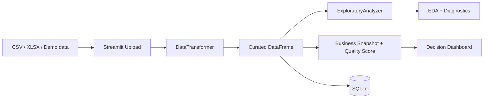

# Data Analytics Workflow

[English version](README.en.md)

[](https://github.com/samuelmaia-analytics/data-senior-analytics/actions/workflows/ci.yml)
[](https://www.python.org/downloads/)
[](https://data-analytics-sr.streamlit.app)
[](LICENSE)

Projeto de analytics que transforma arquivos tabulares em um fluxo curado, rastreável e pronto para apoiar decisões, com dashboard Streamlit, persistência em SQLite, indicadores de qualidade e documentação técnica.

Demo online: https://data-analytics-sr.streamlit.app

## Objetivo do projeto

O objetivo deste projeto é demonstrar uma base prática em análise de dados, BI e analytics engineering: receber dados brutos, aplicar tratamento, validar qualidade, gerar indicadores e entregar uma leitura clara para negócio.

Este repositório resolve isso com uma abordagem em camadas:
- entrada bruta via CSV/XLSX ou datasets demo;
- curadoria automática com padronização, inferência de tipos, tratamento de nulos e deduplicação;
- política versionada de scoring e ações em `config/dashboard_policy.json`;
- leitura de negócio com KPI, qualidade da base, tendências e ações prioritárias;
- persistência do dataset curado em SQLite;
- boas práticas com lint, testes, cobertura, preflight de deploy e rastreabilidade.

## Caso de uso

O dashboard foi desenhado para cenários em que uma equipe precisa responder rapidamente:
- a base está confiável o suficiente para análise?
- quais indicadores merecem atenção?
- existem dados ausentes, duplicados ou inconsistentes?
- qual é a próxima ação recomendada antes de compartilhar ou persistir a base?

## Competências demonstradas

- Tratamento e validação de dados com Python/Pandas.
- Construção de dashboard analítico com Streamlit.
- Organização de código em camadas reutilizáveis.
- Criação de indicadores, score de qualidade e leitura orientada a negócio.
- Persistência local com SQLite.
- Documentação técnica, testes automatizados e CI/CD.
- Boas práticas de governança, rastreabilidade e proteção básica de dados pessoais.

## O que o dashboard entrega

- `Overview`: resumo da base, indicadores, qualidade, risco e próximos passos.
- `Upload`: ingestão de CSV/XLSX com curadoria automática e score de qualidade.
- `Data`: visão lado a lado de bruto vs. curado, com mascaramento quando dados pessoais são detectados.
- `EDA`: estatísticas, correlação, insights automatizados e perfil de valores ausentes.
- `Visualizations`: distribuição, composição de negócio e análise de tendência.
- `Database`: verificação operacional do dataset persistido no SQLite.
- `Settings`: metadados de runtime, qualidade, governança e transformações aplicadas.

## Fluxo ponta a ponta

1. O usuário carrega um CSV/XLSX ou usa um dataset demo.
2. O app aplica `DataTransformer` para gerar uma versão curada.
3. `ExploratoryAnalyzer` produz estatísticas e insights automatizados.
4. `dashboard/utils/analytics.py` converte o profiling em briefing, governança, concentração e narrativa orientada à decisão.
5. O usuário pode persistir a saída curada em SQLite.

## Arquitetura



Documentação relacionada:
- [docs/ARCHITECTURE.md](docs/ARCHITECTURE.md)
- [docs/STREAMLIT_CLOUD.md](docs/STREAMLIT_CLOUD.md)
- [docs/DATA_CONTRACT.md](docs/DATA_CONTRACT.md)
- [docs/DATA_LINEAGE.md](docs/DATA_LINEAGE.md)
- [docs/DATA_PROVENANCE.md](docs/DATA_PROVENANCE.md)

## Screenshots / Demo


## Stack

- `streamlit` para dashboard e experiência de usuário
- `pandas` e `numpy` para transformação e profiling
- `plotly` para visualização analítica
- `sqlite3` via `SQLiteManager` para persistência
- `ruff`, `black`, `pytest` e `pytest-cov` para qualidade de código

## Execução local

```bash
git clone https://github.com/samuelmaia-analytics/data-senior-analytics.git
cd data-senior-analytics
python -m venv .venv

# Linux/macOS
source .venv/bin/activate

# Windows PowerShell
.venv\Scripts\Activate.ps1

pip install -r requirements-dev.txt
python -m streamlit run dashboard/app.py
```

## Qualidade e operação

- CI com lint, formatação, testes e coverage.
- Gate de cobertura em `>=70%`.
- Preflight para Streamlit Cloud.
- Checks de encoding, proveniência e manifesto de dados.
- Controles básicos de governança e LGPD para dados pessoais em preview e persistência.
- Registro de persistência e trilha de auditoria no SQLite.
- Script agendável de purge por retenção e export governado com auditoria.
- Runtime de deploy alinhado em `Python 3.11`.
- Smoke test do dashboard como superfície de produto.

## Estrutura do repositório

- `dashboard/`: interface Streamlit e composição da experiência do usuário
- `src/app/`: serviços de aplicação e orquestração do fluxo curado
- `src/analysis/`: análise exploratória automatizada
- `src/data/`: curadoria, ingestão e persistência
- `config/`: paths e metadados de execução
- `docs/`: arquitetura, deploy e governança
- `docs/LGPD_GOVERNANCE.md`: interpretação prática de privacidade aplicada ao fluxo analítico
- `tests/`: proteção automatizada de comportamento

## Para recrutadores e leads

Este projeto demonstra capacidade de atuar em demandas de análise de dados, BI, automação analítica e apoio a times de negócio. É adequado para conversas sobre oportunidades como Analista de Dados, Analista de BI, Analytics Engineer em início/intermediário ou projetos freelance de organização e visualização de dados.

## Licença

Licenciado sob MIT. Veja [LICENSE](LICENSE).
