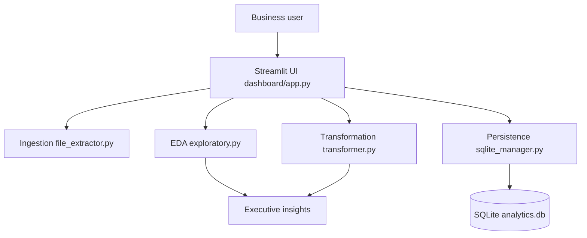
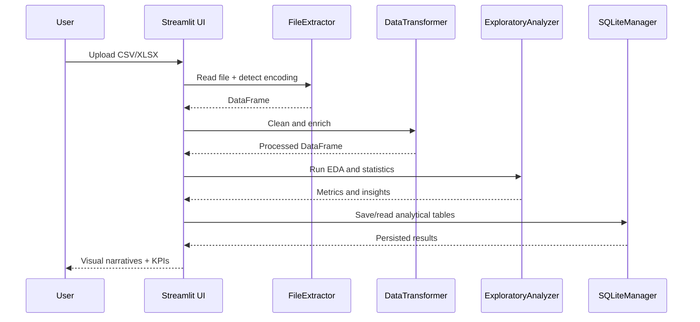

# Architecture

## Context
This project targets executive-level analytics delivery with clear governance, reproducibility, and fast deployment on Streamlit Cloud.

## System View

## Runtime Sequence

## Module Boundaries
- `dashboard/app.py`: orchestration and routing.
- `dashboard/pages/*`: page-level rendering logic.
- `dashboard/utils/*`: shared analytical helpers for pages.
- `src/data/*`: ingestion, transformations, persistence.
- `src/analysis/*`: exploratory analytics and report generation.
- `config/*`: settings and data provenance.

## Quality Controls
- Lint: `ruff`
- Tests: `pytest`
- Encoding guard: `scripts/check_encoding.py`
- Cloud preflight: `scripts/streamlit_cloud_preflight.py`
- Data provenance validation: `scripts/validate_data_provenance.py`
